# WaveFlow 마이크로서비스 기술 인수인계 문서

## 1. 프로젝트 개요 (Project Overview)

### 핵심 목적과 주요 기능
WaveFlow 마이크로서비스는 **음악 협업 플랫폼을 위한 오디오 파일 처리 전용 비동기 워커 시스템**입니다. 이 서비스는 다음과 같은 핵심 기능을 제공합니다:

- **오디오 파일 해시 생성 및 중복 검사**: 업로드된 오디오 파일의 SHA-256 해시를 생성하여 중복 파일 검출
- **오디오 파형 데이터 생성**: librosa를 사용한 고품질 오디오 분석 및 파형 시각화 데이터 생성
- **AWS 기반 파일 관리**: S3를 통한 안전한 파일 저장 및 관리
- **실시간 웹훅 통신**: NestJS 메인 서버와 양방향 통신으로 처리 상태 실시간 업데이트

### 비즈니스 문제 해결
이 마이크로서비스는 음악 협업 플랫폼에서 다음과 같은 문제를 해결하기 위해 개발되었습니다:

1. **대용량 오디오 파일 처리**: 메인 서버의 부하를 줄이기 위한 비동기 처리
2. **중복 파일 방지**: 스토리지 비용 절감 및 데이터 중복 방지
3. **실시간 파형 시각화**: 음악 협업을 위한 직관적인 오디오 시각화 제공
4. **확장 가능한 아키텍처**: AWS 기반 마이크로서비스로 트래픽 증가에 대응

## 2. 기술 스택 (Tech Stack)

- **언어:** Python 3.9
- **프레임워크:** Celery 5.3.4 (비동기 작업 처리)
- **메시지 브로커:** AWS SQS (Simple Queue Service)
- **클라우드 서비스:** AWS (S3, EC2, IAM Role)
- **주요 라이브러리:**
  - librosa 0.10.1: 오디오 분석 및 처리
  - numpy 1.24.3: 수치 계산 및 배열 처리
  - boto3 1.34.0: AWS SDK
  - python-magic 0.4.27: 파일 형식 검증
  - soundfile 0.12.1: 오디오 파일 I/O
  - kombu[sqs] 5.3.4: SQS 메시지 처리
- **컨테이너화:** Docker + Docker Compose
- **테스트:** pytest, moto (AWS 모킹)
- **CI/CD:** GitHub Actions (자동 EC2 배포)

## 3. 아키텍처 (Architecture)

### 전체 시스템 구조

```mermaid
graph TB
    A[NestJS 메인 서버] --> B[AWS SQS Queue]
    B --> C[Celery Worker]
    C --> D[S3 Bucket]
    C --> E[AudioProcessor]
    C --> F[WebHook Handler]
    F --> A
    
    subgraph "오디오 처리 워크플로우"
        G[1. 해시 생성] --> H[2. 중복 검사]
        H --> I[3a. 중복 파일 삭제]
        H --> J[3b. 오디오 분석]
        J --> K[파형 데이터 생성]
    end
    
    C --> G
```



### 4단계 워크플로우 처리 흐름

1. **해시 생성 단계** (`generate_hash_and_webhook`)
   - S3에서 오디오 파일 다운로드
   - SHA-256 해시 생성
   - 웹훅으로 NestJS 서버에 해시 전송

2. **중복 검사 단계** (NestJS 서버에서 처리)
   - 데이터베이스에서 해시 중복 여부 확인
   - 결과에 따라 다음 단계 결정

3. **분기 처리 단계**
   - **중복 있음**: `process_duplicate_file` → S3 파일 삭제
   - **중복 없음**: `process_audio_analysis` → 파형 데이터 생성

4. **믹싱 작업 단계** (`mix_stems_and_upload`)
   - 여러 스템 파일들을 S3에서 다운로드
   - 오디오 믹싱 수행 (볼륨 정규화 포함)
   - 믹싱된 파일을 S3에 업로드

### 외부 서비스 연동
- **NestJS 메인 서버**: 웹훅 통신으로 실시간 상태 업데이트
- **AWS SQS**: 메시지 큐를 통한 비동기 작업 전달
- **AWS S3**: 오디오 파일 및 파형 데이터 저장
- **AWS EC2**: IAM Role을 통한 안전한 리소스 접근

## 4. 프로젝트 설치 및 실행 방법 (Setup and Execution)

### 환경 변수 설정
```bash
# .env 파일 생성
AWS_REGION=ap-northeast-2
S3_BUCKET_NAME=your-waveflow-bucket
SQS_QUEUE_URL=https://sqs.ap-northeast-2.amazonaws.com/account/queue-name
WEBHOOK_URL=https://your-nestjs-server.com/webhook
LOG_LEVEL=INFO
```

### Docker를 사용한 실행
```bash
# 컨테이너 빌드 및 실행
docker-compose up --build

# 백그라운드 실행
docker-compose up -d
```

### 로컬 개발 환경
```bash
# 의존성 설치
pip install -r requirements.txt

# 워커 실행
./run_worker.sh

# 또는 직접 실행
celery -A app.celery_app worker --loglevel=info
```

### 자동 배포 (CI/CD)
- GitHub Actions를 통한 자동 EC2 배포
- 코드 커밋 시 자동으로 빌드 및 배포 실행
- 무중단 배포를 위한 스크립트 포함

### EC2 인스턴스 최적화 (c7i-large)
- **인스턴스 사양**: 2 vCPU, 4GB RAM
- **워커 동시성**: 2개 (가벼운 작업과 무거운 작업의 효율적 밸런스)
- **메모리 최적화**: 태스크당 최대 100회 실행 후 워커 재시작
- **캐싱 최적화**: Numba JIT 컴파일, librosa 캐싱 활용
- **실시간 모니터링**: 각 태스크별 메모리 사용량 실시간 로깅

## 5. 주요 기능 상세 설명 (Core Features)

### 해시 생성 및 웹훅 전송 기능 흐름

1. **메시지 수신**: SQS에서 다음 형태의 메시지 수신
```json
{
  "userId": "user123",
  "trackId": "track456", 
  "stemId": "stem789",
  "filepath": "audio/sample.wav",
  "timestamp": "2024-01-01T10:00:00Z",
  "original_filename": "sample.wav"
}
```

2. **파일 처리**: `AudioProcessor.calculate_sha256()` 메서드로 해시 생성

3. **웹훅 전송**: `/hash-check` 엔드포인트로 NestJS 서버에 해시 전송

4. **응답 처리**: 중복 검사 결과에 따른 후속 처리

### 오디오 분석 기능 흐름

1. **파일 검증**: MIME 타입 및 파일 크기 확인
2. **오디오 로딩**: librosa를 사용한 오디오 데이터 로딩
3. **파형 생성**: 지정된 피크 수만큼 파형 데이터 생성
4. **S3 저장**: 파형 JSON 데이터를 S3에 저장
5. **웹훅 전송**: 완료 결과를 NestJS 서버에 전송

## 6. API 엔드포인트 명세 (API Endpoint Specification)

### 웹훅 엔드포인트 (NestJS 서버 → 이 서비스)

| Method | Endpoint | 설명 | 요청 Body | 성공 응답 | 실패 응답 |
|--------|----------|------|-----------|-----------|-----------|
| POST | `/hash-check` | 해시 중복 검사 요청 | HashCheckRequest | 200 OK | 400 Bad Request |
| POST | `/completion` | 작업 완료 알림 | CompletionRequest | 200 OK | 500 Internal Error |

### SQS 메시지 형식

#### 1. 해시 생성 요청
```json
{
  "task": "app.tasks.generate_hash_and_webhook",
  "userId": "string",
  "trackId": "string", 
  "stemId": "string",
  "filepath": "string",
  "timestamp": "string",
  "original_filename": "string"
}
```

#### 2. 중복 파일 처리 요청
```json
{
  "task": "app.tasks.process_duplicate_file",
  "userId": "string",
  "trackId": "string",
  "stemId": "string", 
  "filepath": "string",
  "audio_hash": "string"
}
```

#### 3. 오디오 분석 요청
```json
{
  "task": "app.tasks.process_audio_analysis",
  "userId": "string",
  "trackId": "string",
  "stemId": "string",
  "filepath": "string",
  "audio_hash": "string",
  "num_peaks": 4000
}
```

#### 4. 믹싱 작업 요청
```json
{
  "task": "app.tasks.mix_stems_and_upload",
  "stageId": "string",
  "stem_paths": ["string", "string"]
}
```

## 7. 핵심 모듈 및 클래스 상세 설명 (Core Modules & Classes)

### 프로젝트 디렉토리 구조
```
WaveFlow-microService/
├── app/
│   ├── __init__.py
│   ├── celery_app.py          # Celery 앱 초기화 및 설정
│   ├── config.py              # 환경 변수 및 설정 관리
│   ├── tasks.py               # Celery 작업 정의
│   ├── audio_processor.py     # 오디오 처리 핵심 로직
│   ├── aws_utils.py           # AWS 서비스 연동 유틸리티
│   ├── webhook.py             # 웹훅 전송 처리
│   ├── message_handler.py     # 커스텀 메시지 처리
│   └── simple_handler.py      # 간단한 핸들러
├── tests/
│   ├── __init__.py
│   └── test_audio_processor.py # 단위 테스트
├── scripts/
│   ├── deploy.sh              # 배포 스크립트
│   ├── setup-aws-permissions.sh
│   └── setup-ec2.sh
├── Dockerfile                 # Docker 이미지 정의
├── docker-compose.yml         # Docker 컨테이너 설정
├── requirements.txt           # Python 의존성
├── run_worker.sh             # 워커 실행 스크립트
└── README.md
```

### 핵심 클래스 및 함수 상세

#### app/celery_app.py
Celery 애플리케이션 초기화 및 설정을 담당합니다.

**주요 기능:**
- AWS SQS 브로커 설정
- Numba JIT 컴파일 최적화
- 작업 실행 신호 핸들러
- 커스텀 메시지 처리 설정

**핵심 설정:**
```python
celery_app.conf.update(
    broker_url='sqs://',
    result_backend='cache+memory://',
    task_serializer='json',
    broker_transport_options={
        'region': 'ap-northeast-2',
        'visibility_timeout': 3600,
        'polling_interval': 5
    }
)
```

#### app/tasks.py
비동기 작업 정의 및 실행 로직을 담당합니다.

**주요 함수:**
- `generate_hash_and_webhook()`: 1단계 해시 생성 및 웹훅 전송
- `process_duplicate_file()`: 2단계 중복 파일 처리
- `process_audio_analysis()`: 3단계 오디오 분석 처리
- `health_check()`: 시스템 상태 확인
- `cleanup_temp_files()`: 임시 파일 정리

#### app/audio_processor.py - AudioProcessor 클래스
오디오 파일 처리의 핵심 로직을 담당합니다.

**주요 메서드:**
- `validate_file_size()`: 파일 크기 검증 (최대 100MB)
- `validate_mime_type()`: MIME 타입 검증 (audio/wav, audio/mp3 등)
- `calculate_sha256()`: SHA-256 해시 계산
- `load_audio_data()`: librosa를 사용한 오디오 데이터 로딩
- `generate_waveform_peaks()`: 파형 피크 데이터 생성
- `process_all()`: 전체 처리 파이프라인 실행

**사용 예시:**
```python
processor = AudioProcessor('/tmp/audio.wav')
result = processor.process_all(num_peaks=1024)
# 결과: 파형 데이터, 해시, 메타데이터 포함
```

#### app/aws_utils.py - AWSUtils 클래스
AWS 서비스 연동을 위한 유틸리티 클래스입니다.

**주요 메서드:**
- `download_from_s3()`: S3에서 파일 다운로드
- `upload_to_s3()`: S3에 파일 업로드
- `delete_from_s3()`: S3에서 파일 삭제

**EC2 IAM Role 사용:**
```python
# 자격 증명 없이 IAM Role로 자동 인증
aws_utils = AWSUtils()
aws_utils.download_from_s3('audio/file.wav', '/tmp/file.wav')
```

#### app/webhook.py
웹훅 전송 처리를 담당합니다.

**주요 함수:**
- `send_hash_webhook()`: 해시 생성 완료 웹훅 전송
- `send_completion_webhook()`: 작업 완료 웹훅 전송

#### app/config.py
환경 변수 관리 및 설정을 담당합니다.

**주요 함수:**
- `validate_config()`: 필수 환경 변수 검증
- `get_config()`: 전체 설정 딕셔너리 반환
- `get_sqs_queue_name()`: SQS 큐 이름 추출

### 파일 관리 정책

#### ✅ 보존되는 파일들
- **S3 원본 오디오 파일**: 모든 처리 후에도 영구 보존
- **S3 파형 데이터**: 분석 결과 JSON 파일들 보존

#### 🗑️ 정리되는 파일들
- **EC2 임시 오디오 파일**: 각 태스크 완료 후 즉시 삭제
- **EC2 임시 파형 파일**: 각 태스크 완료 후 즉시 삭제
- **30분 이상 된 임시 파일**: 주기적 자동 정리

### 로깅 및 모니터링

#### 로그 레벨 설정
```python
LOG_LEVEL = INFO  # DEBUG, INFO, WARNING, ERROR
LOG_FORMAT = '%(asctime)s - %(name)s - %(levelname)s - %(message)s'
```

#### 헬스 체크 및 유지보수
```bash
# 시스템 상태 확인
celery -A app.celery_app call health_check

# 임시 파일 정리
celery -A app.celery_app call cleanup_temp_files

# 워커 상태 모니터링
celery -A app.celery_app inspect active
```

### 테스트 및 품질 관리

#### 테스트 실행
```bash
# 모든 테스트 실행
pytest tests/

# 커버리지 포함 테스트
pytest --cov=app tests/

# 특정 테스트 실행
pytest tests/test_audio_processor.py::TestAudioProcessor::test_process_all
```

#### 테스트 구조
- **단위 테스트**: `tests/test_audio_processor.py`
- **통합 테스트**: AWS 서비스 모킹 포함
- **테스트 픽스처**: 실제 오디오 파일 생성 및 정리

### 성능 최적화

#### Numba JIT 컴파일
```python
# 시작 시 성능 중요 함수들 워밍업
warmup_numba_functions()
```

#### 캐싱 설정
```python
# Librosa 캐싱으로 성능 향상
os.environ['LIBROSA_CACHE_DIR'] = '/tmp/librosa_cache'
os.environ['LIBROSA_CACHE_LEVEL'] = '10'
```

#### 메모리 모니터링
```python
# 각 태스크별 메모리 사용량 실시간 로깅
def log_memory_usage(task_name: str, stage: str):
    process = psutil.Process()
    memory_info = process.memory_info()
    memory_percent = process.memory_percent()
    logger.info(f"[{task_name}] {stage} - 메모리: {memory_info.rss / 1024 / 1024:.1f}MB ({memory_percent:.1f}%)")
```

### 에러 처리 및 재시도

#### 재시도 로직
```python
# 최대 3회 재시도, 지수 백오프
if self.request.retries < self.max_retries:
    countdown = min(60 * (2 ** self.request.retries), 300)
    raise self.retry(exc=e, countdown=countdown)
```

#### 그레이스풀 종료
```bash
# 진행 중인 작업 완료 후 종료
trap cleanup SIGTERM SIGINT
```

이 문서는 WaveFlow 마이크로서비스의 모든 핵심 기능과 구조를 상세히 설명하고 있습니다. 새로운 개발자가 이 문서만으로도 프로젝트를 완전히 이해하고 즉시 유지보수 및 추가 개발을 시작할 수 있도록 구성되었습니다.